# Revisión de avance de proyecto: Planteamiento del problema y propuesta de solución

## Interfaz Cerebro-Computadora para el control de dispositivos mediante detección en tiempo real de imaginación motora

---

## Tabla de Contenidos
1. [Introducción](#introducción)
2. [Problemática](#problemática)
3. [Propuesta de Solución](#propuesta-de-solución)
4. [Objetivos del Proyecto](#objetivos-del-proyecto)
5. [Metodología](#metodología)
   - 5.1 [Señal EEG](#señal-eeg)
   - 5.2 [Dataset Utilizado](#dataset-utilizado)
6. [Análisis Exploratorio de Datos (EDA)](#análisis-exploratorio-de-datos-eda)
   - 6.1 [Descripción General](#descripción-general)
   - 6.2 [Análisis por Run](#análisis-por-run)
7. [Herramientas Utilizadas](#herramientas-utilizadas)
8. [Próximos Pasos](#próximos-pasos)
9. [Referencias Bibliográficas](#referencias-bibliográficas)
10. [Contribuciones](#contribuciones)

---

## Introducción

Las personas con discapacidades motoras severas enfrentan importantes barreras para interactuar con dispositivos electrónicos y realizar tareas cotidianas. Este proyecto propone el desarrollo de una **Interfaz Cerebro-Computadora (BCI)** que permite el control de dispositivos mediante la detección de imaginación motora usando señales de electroencefalografía (EEG).

La imaginación motora se refiere a la actividad cerebral asociada con pensar en realizar un movimiento sin ejecutarlo físicamente. Esta capacidad puede ser aprovechada para crear sistemas de control no invasivos que mejoren significativamente la calidad de vida de personas con lesiones medulares o enfermedades neuromusculares.

---

## Problemática

Según la Organización Mundial de la Salud (OMS), más de **15 millones de personas** viven con lesiones medulares a nivel mundial, y anualmente entre **250,000 y 500,000** personas sufren una nueva lesión medular [1]. En Perú, el Instituto Nacional de Rehabilitación (INR) reportó más de **1,500 atenciones** por lesión medular entre enero y mayo de 2024 [2].

Estas personas enfrentan limitaciones severas para:
- Interactuar con dispositivos electrónicos convencionales
- Controlar elementos básicos de su entorno (luces, electrodomésticos)
- Mantener autonomía en actividades diarias
- Comunicarse efectivamente con su entorno

Los sistemas de control tradicionales (botones, pantallas táctiles, controles manuales) no son accesibles para todos, especialmente cuando las lesiones impiden el movimiento de extremidades.

**Se necesita:** Un método no invasivo, económico y en tiempo real que permita controlar dispositivos básicos a través de señales cerebrales, sin depender del movimiento muscular.

---

## Propuesta de Solución

El proyecto propone desarrollar una **Interfaz Cerebro-Computadora (BCI)** capaz de:

1. **Capturar señales EEG** de regiones motoras del cerebro (electrodos C3, Cz, C4)
2. **Detectar patrones de imaginación motora** asociados a diferentes movimientos:
   - Mano izquierda
   - Mano derecha
   - Ambas manos
   - Ambos pies
3. **Clasificar en tiempo real** la intención del usuario mediante algoritmos de Machine Learning
4. **Traducir la intención a comandos** para controlar dispositivos externos

### ¿Cómo funciona?

La corteza motora genera patrones específicos de actividad eléctrica cuando imaginamos movimientos. Estos patrones se manifiestan como cambios en las **oscilaciones mu (8-13 Hz)** y **beta (13-30 Hz)**, fenómeno conocido como **desincronización/resincronización relacionada a eventos (ERD/ERS)** [4].

Mediante el procesamiento de estas señales y técnicas de aprendizaje automático, es posible identificar qué extremidad el usuario está imaginando mover, y mapear esta intención a una acción de control específica.

---

## Objetivos del Proyecto

### Objetivos Principales
- ✅ Implementar un pipeline de procesamiento de señales EEG para detección de imaginación motora
- ✅ Validar algoritmos usando datasets públicos (PhysioNet EEGMMIDB)
- 🔄 Entrenar y evaluar clasificadores de Machine Learning (LDA, SVM, CNN)
- 🔄 Implementar clasificación en tiempo real
- 🔄 Desarrollar interfaz funcional para mapeo de comandos

### Alcances
- **Software completo:** Preprocesamiento, extracción de características, clasificación
- **No invasivo:** Uso de EEG externo, seguro para usuarios
- **Bajo costo:** Implementable con hardware accesible
- **Privacidad:** Anonimización de datos y consentimiento informado

---

## Metodología

### Señal EEG

La **electroencefalografía (EEG)** mide diferencias de potencial eléctrico en la superficie del cuero cabelludo generadas por la actividad neuronal. Para este proyecto:

- **Electrodos de interés:** C3, Cz, C4 (región motora central)
- **Bandas de frecuencia relevantes:**
  - **Mu (μ):** 8-13 Hz - Asociada a actividad motora
  - **Beta (β):** 13-30 Hz - Relacionada con preparación y ejecución motora
- **Fenómeno clave:** ERD (Event-Related Desynchronization) - Disminución de amplitud durante imaginación motora

**Propiedades típicas:**
- Duración del evento: 0.5-2 segundos
- Amplitud: 5-30 µV sobre línea base
- Latencia: Comienza ~200-500 ms antes del movimiento imaginado

### Dataset Utilizado

**EEG Motor Movement/Imagery Dataset (EEGMMIDB) - PhysioNet**

- **Sujetos:** 109 voluntarios sanos
- **Canales:** 64 electrodos EEG
- **Frecuencia de muestreo:** 160 Hz
- **Formato:** EDF+ (European Data Format)
- **Sesiones:** 14 runs por sujeto, 6 de imaginación motora

#### Tareas de Imaginación Motora

| Run | Tarea T1 | Tarea T2 |
|-----|----------|----------|
| R04 | Mano izquierda (imaginada) | Mano derecha (imaginada) |
| R06 | Ambas manos (imaginadas) | Ambos pies (imaginados) |
| R08 | Mano izquierda (imaginada) | Mano derecha (imaginada) |
| R10 | Ambas manos (imaginadas) | Ambos pies (imaginados) |
| R12 | Mano izquierda (imaginada) | Mano derecha (imaginada) |
| R14 | Ambas manos (imaginadas) | Ambos pies (imaginados) |

#### Eventos en el Dataset

- **T0:** Reposo (línea base)
- **T1:** Inicio de imaginación de movimiento (izquierda/ambas manos)
- **T2:** Inicio de imaginación de movimiento (derecha/ambos pies)

---

## Análisis Exploratorio de Datos (EDA)

### Descripción General

Se realizó un análisis exploratorio del **Sujeto S001** procesando los 6 runs de imaginación motora. El análisis incluyó:

1. **Inspección de metadatos:** Duración, frecuencia de muestreo, canales disponibles
2. **Conteo de eventos:** Distribución de T0, T1, T2 por run
3. **Análisis temporal:** Visualización de señales crudas en canales motores
4. **Análisis espectral:** Densidad espectral de potencia (PSD) en bandas relevantes
5. **Event-Related Potentials (ERP):** Respuestas promedio a tareas motoras

### Resumen de S001

| Run | Duración (s) | T0 (Reposo) | T1 | T2 | Tarea T1 | Tarea T2 |
|-----|--------------|-------------|----|----|----------|----------|
| R04 | 125.0 | 15 | 8 | 7 | Mano Izq | Mano Der |
| R06 | 125.0 | 15 | 7 | 8 | Ambas Manos | Ambos Pies |
| R08 | 125.0 | 15 | 8 | 7 | Mano Izq | Mano Der |
| R10 | 125.0 | 15 | 7 | 8 | Ambas Manos | Ambos Pies |
| R12 | 125.0 | 15 | 8 | 7 | Mano Izq | Mano Der |
| R14 | 125.0 | 15 | 7 | 8 | Ambas Manos | Ambos Pies |

### Análisis por Run

#### Run 04: Mano Izquierda vs Mano Derecha

##### Señales Temporales (30s)
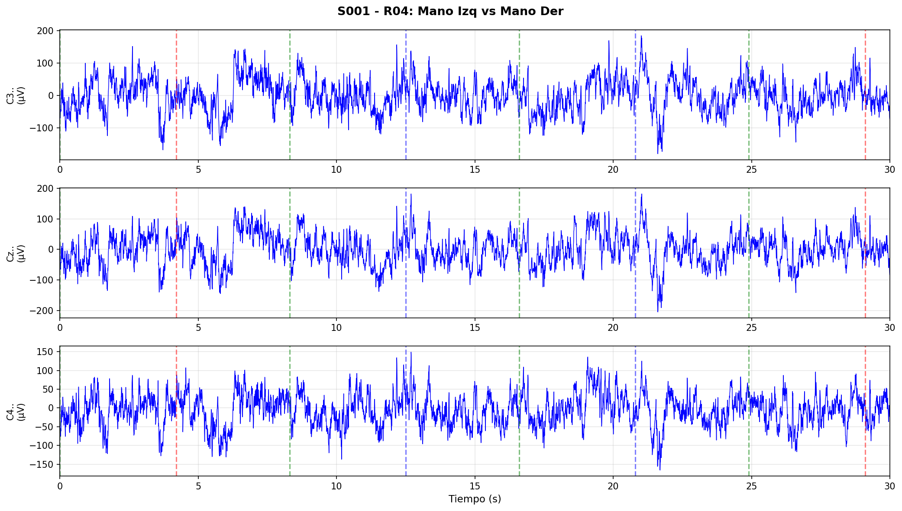

*Descripción: Señales EEG de los canales C3, Cz y C4 durante los primeros 30 segundos. Las líneas verticales indican eventos: verde (T0 - reposo), azul (T1 - mano izquierda), rojo (T2 - mano derecha). Se observa [DESCRIPCIÓN A COMPLETAR SEGÚN LA IMAGEN].*

##### Densidad Espectral de Potencia
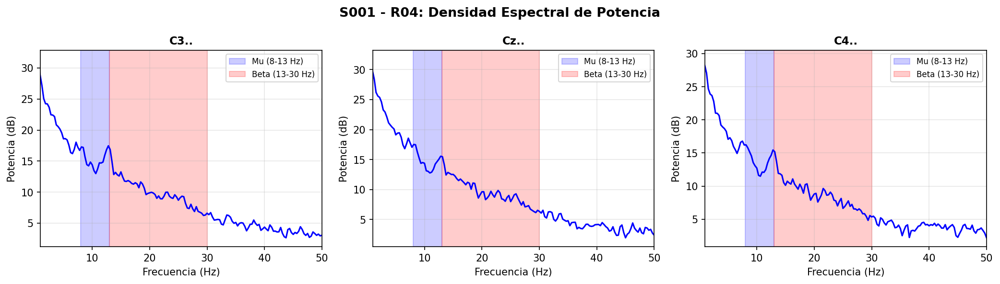

*Descripción: Análisis de frecuencias para cada canal motor. Las áreas sombreadas destacan las bandas Mu (8-13 Hz, azul) y Beta (13-30 Hz, rojo), cruciales para detectar imaginación motora. Se puede observar [DESCRIPCIÓN A COMPLETAR].*

##### Event-Related Potentials
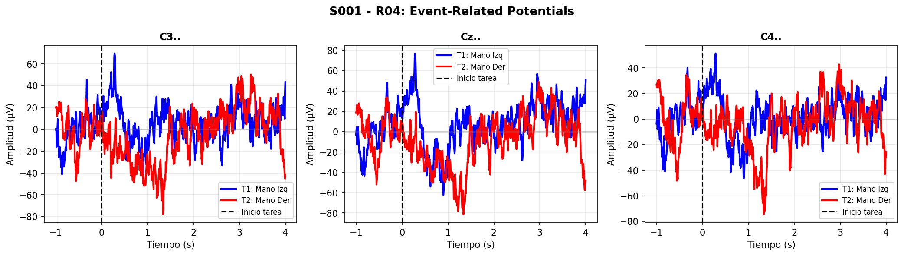

*Descripción: Respuestas promediadas del cerebro durante la imaginación de movimientos. La línea azul representa mano izquierda (T1) y la roja mano derecha (T2). La línea vertical negra marca el inicio de la tarea. [DESCRIPCIÓN A COMPLETAR].*

---

#### Run 06: Ambas Manos vs Ambos Pies

##### Señales Temporales (30s)
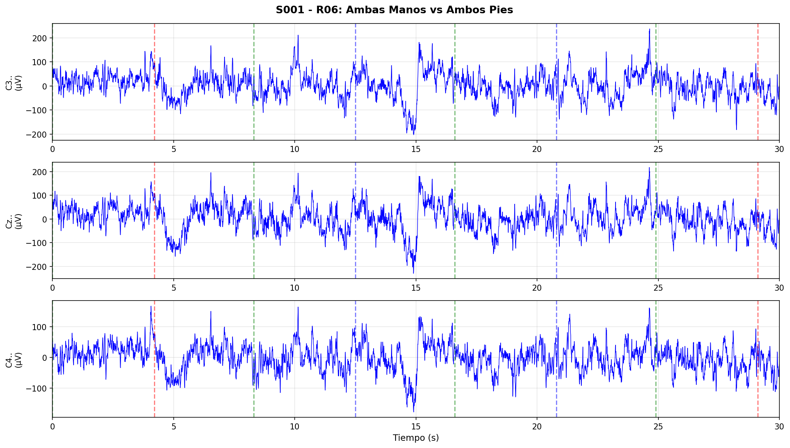

*Descripción: [A COMPLETAR]*

##### Densidad Espectral de Potencia
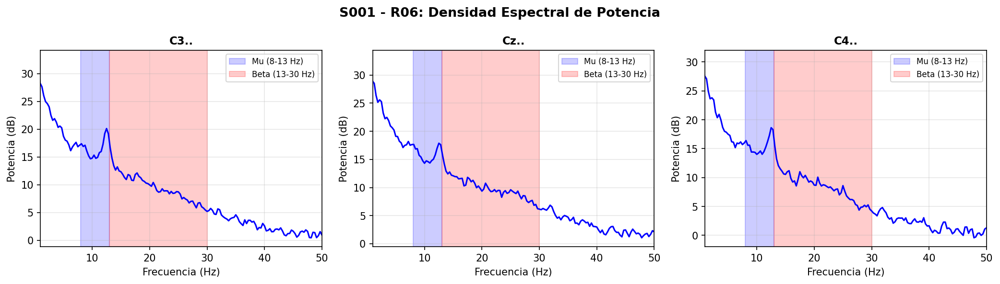

*Descripción: [A COMPLETAR]*

##### Event-Related Potentials
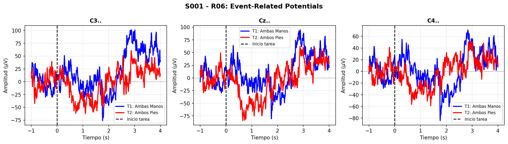

*Descripción: [A COMPLETAR]*

---

#### Run 08: Mano Izquierda vs Mano Derecha

##### Señales Temporales (30s)
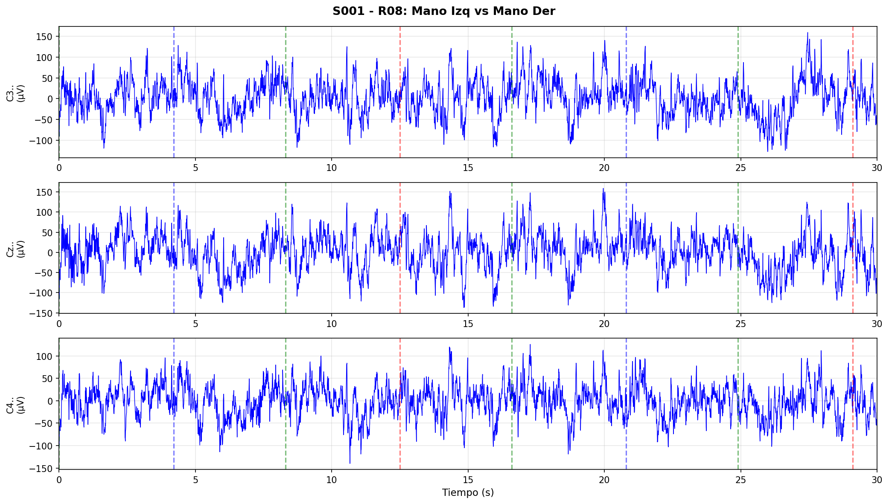

*Descripción: [A COMPLETAR]*

##### Densidad Espectral de Potencia
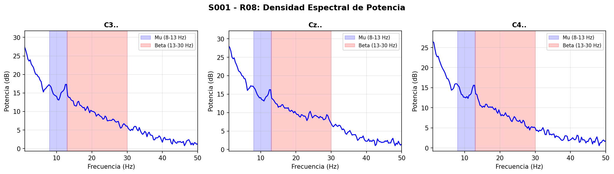

*Descripción: [A COMPLETAR]*

##### Event-Related Potentials
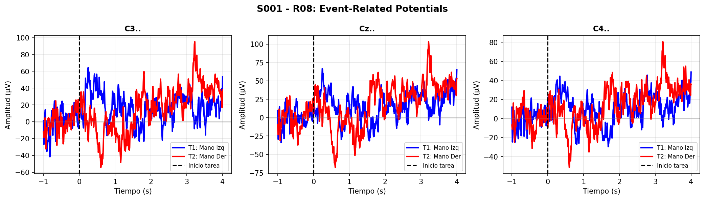

*Descripción: [A COMPLETAR]*

---

#### Run 10: Ambas Manos vs Ambos Pies

##### Señales Temporales (30s)
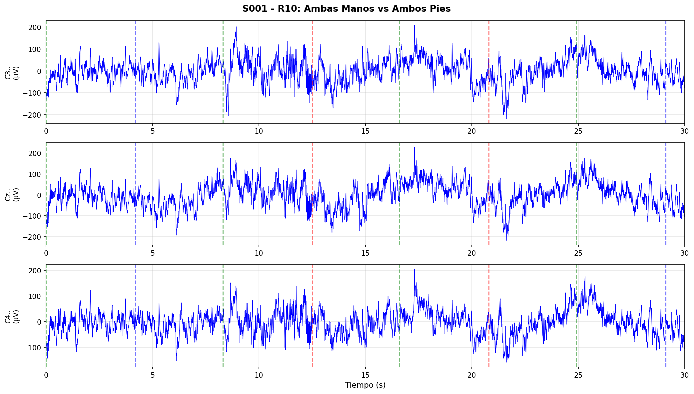

*Descripción: [A COMPLETAR]*

##### Densidad Espectral de Potencia
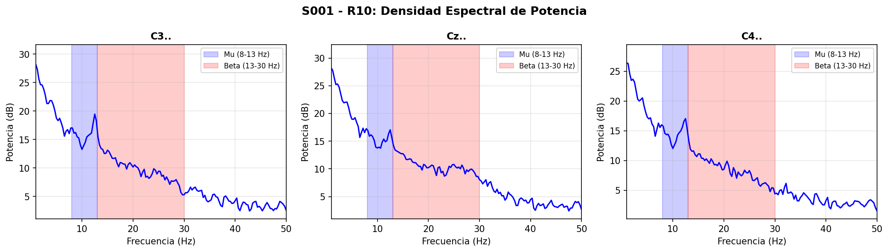

*Descripción: [A COMPLETAR]*

##### Event-Related Potentials
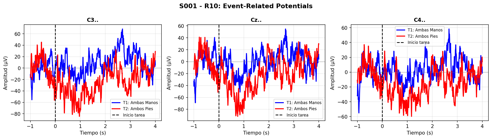

*Descripción: [A COMPLETAR]*

---

#### Run 12: Mano Izquierda vs Mano Derecha

##### Señales Temporales (30s)

*Descripción: [A COMPLETAR]*

##### Densidad Espectral de Potencia
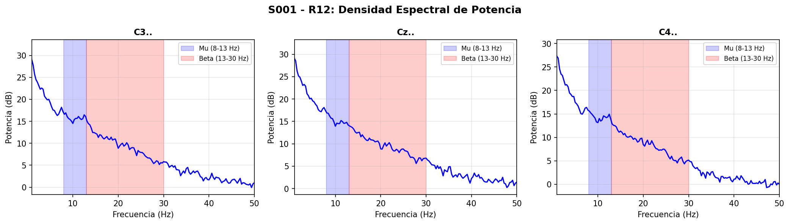

*Descripción: [A COMPLETAR]*

##### Event-Related Potentials
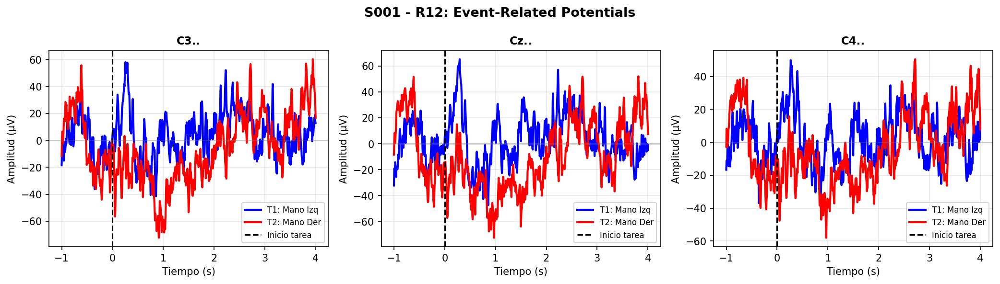

*Descripción: [A COMPLETAR]*

---

#### Run 14: Ambas Manos vs Ambos Pies

##### Señales Temporales (30s)
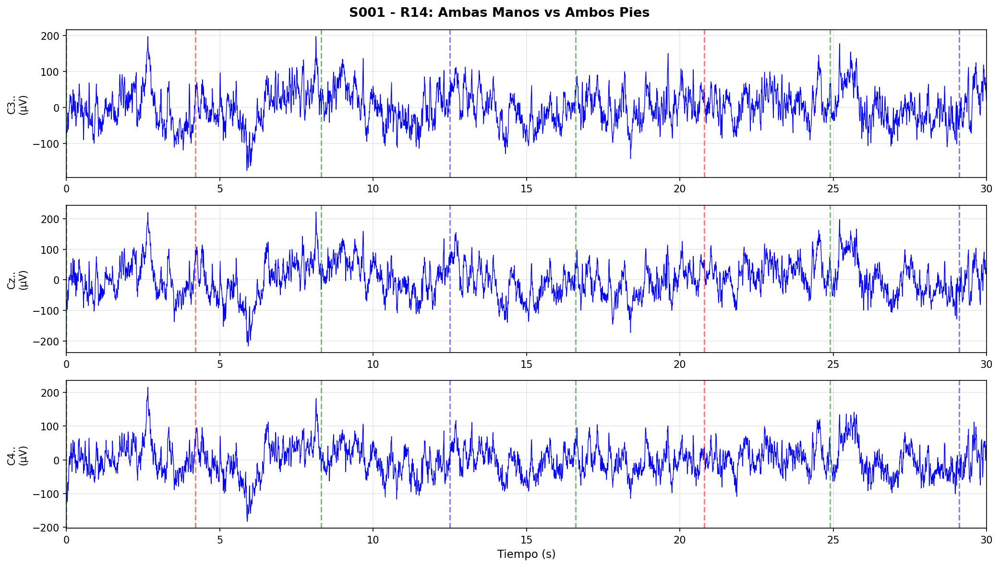

*Descripción: [A COMPLETAR]*

##### Densidad Espectral de Potencia
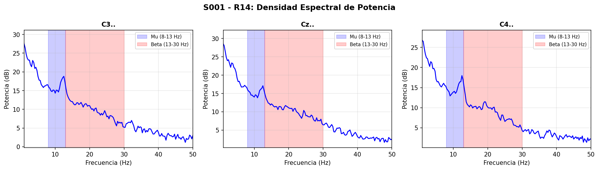

*Descripción: [A COMPLETAR]*

##### Event-Related Potentials
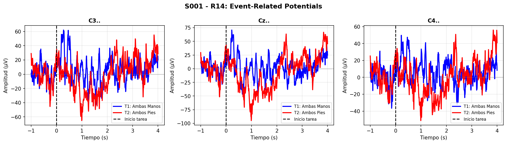

*Descripción: [A COMPLETAR]*

---

## Herramientas Utilizadas

### Software y Librerías
- **Python 3.12**
- **MNE-Python:** Procesamiento de señales EEG
- **NumPy/Pandas:** Manipulación y análisis de datos
- **Matplotlib/Seaborn:** Visualización
- **Scikit-learn:** Machine Learning (próxima etapa)
- **SciPy:** Procesamiento de señales

### Plataformas
- **Visual Studio Code:** Desarrollo
- **GitHub:** Control de versiones
- **Google Colab:** Alternativa para ejecución sin configuración local

### Dataset
- **PhysioNet EEGMMIDB:** Base de datos pública de acceso abierto
- **Formato:** EDF+ (European Data Format)

---

## Próximos Pasos

### Fase 1: Preprocesamiento Avanzado ✅ (En progreso)
- [x] Carga y exploración de datos
- [ ] Filtrado de señales (pasa banda 8-30 Hz)
- [ ] Eliminación de artefactos (EOG, EMG)
- [ ] Normalización y segmentación por eventos

### Fase 2: Extracción de Características 🔄
- [ ] Common Spatial Patterns (CSP)
- [ ] Análisis de potencia espectral (PSD)
- [ ] Transformada de Fourier (FFT)
- [ ] Características tiempo-frecuencia

### Fase 3: Modelado y Clasificación 📋
- [ ] Entrenar clasificadores base (LDA, SVM)
- [ ] Explorar redes neuronales (CNN, LSTM)
- [ ] Validación cruzada y optimización de hiperparámetros
- [ ] Evaluación de métricas (accuracy, F1-score, matriz de confusión)

### Fase 4: Implementación en Tiempo Real 📋
- [ ] Pipeline de procesamiento online
- [ ] Reducción de latencia
- [ ] Interfaz de usuario
- [ ] Mapeo de comandos a acciones

---

## Referencias Bibliográficas

[1] World Health Organization: WHO, "Spinal cord injury," Apr. 16, 2024. [Online]. Available: https://www.who.int/news-room/fact-sheets/detail/spinal-cord-injury

[2] MINSA, "Instituto Nacional de Rehabilitación brindó más de 1500 atenciones en consulta médica a pacientes con diagnóstico de lesión medular," Gob.pe. [Online]. Available: https://www.gob.pe/institucion/minsa/noticias/975047

[3] He, H., & Wu, D. "Transfer learning for brain–computer interfaces: A Euclidean space data alignment approach" IEEE Trans Biomed Eng, 2019. [Online]. Available: https://pubmed.ncbi.nlm.nih.gov/31034407/

[4] Lotte, F., et al. "A review of classification algorithms for EEG-based brain–computer interfaces" Journal of Neural Engineering, 2018. [Online]. Available: https://pubmed.ncbi.nlm.nih.gov/17409472/

[5] Schalk, G., McFarland, D.J., Hinterberger, T., Birbaumer, N., Wolpaw, J.R. "BCI2000: A General-Purpose Brain-Computer Interface (BCI) System" IEEE Transactions on Biomedical Engineering 51(6):1034-1043, 2004.

[6] Pfurtscheller, G., & Lopes da Silva, F.H. "Event-related EEG/MEG synchronization and desynchronization: basic principles" Clinical Neurophysiology, 110(11), 1842-1857, 1999.

---

## Contribuciones

### Equipo de Desarrollo - Grupo 03

| Integrante | Porcentaje |
|------------|------------|
| Leon Achata | 33.33% |
| Nicolas Arango | 33.33% |
| Hans Navarro | 33.33% |

---
**Curso:** Introducción a Señales Biomédicas  
**Institución:** UPCH

**Semestre:** 2025-II  

---
